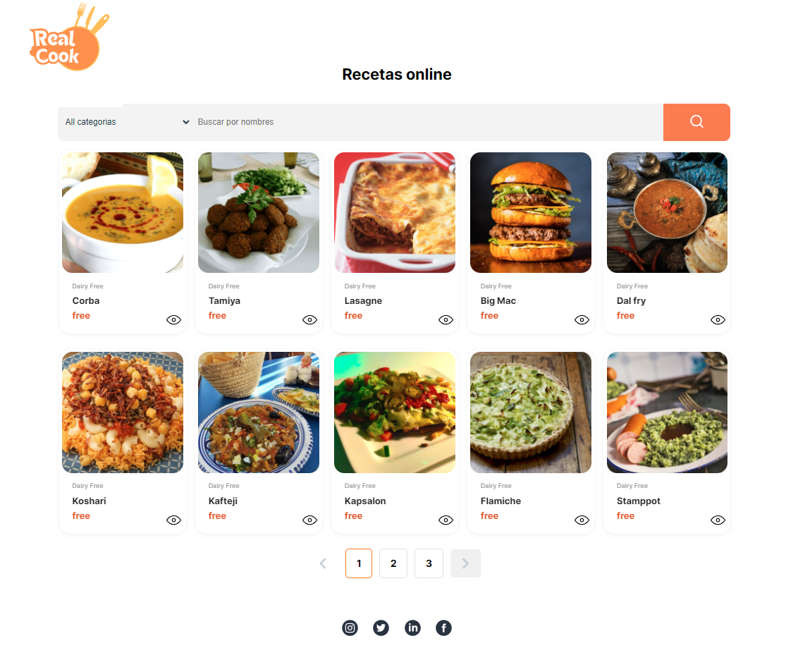
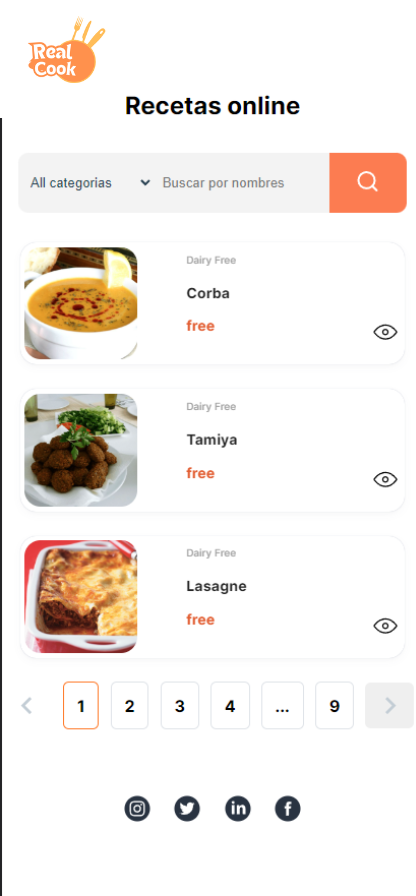

# **App Recipes Pro**  

Aplicación web que ofrece a los usuarios la posibilidad de explorar y descubrir  recetas de cocina.
 

 

## Características Principales:
- 🍔 **Filtrado por Categorías:** La aplicación cuenta con un sistema de filtrado que permite a los usuarios explorar las recetas según sus preferencias culinarias. Los usuarios pueden filtrar las recetas por categorías como "Vegetal", "Sopas", "Postres", entre otras, facilitando la búsqueda de recetas específicas según el tipo de platillo deseado.

- 📖 **Paginación Personalizada:** Se ha implementado una función de paginación personalizada, creada desde cero sin el uso de librerías externas. Esta paginación asegura que los usuarios puedan navegar cómodamente entre un gran número de recetas, mejorando la usabilidad y reduciendo los tiempos de carga.

- 📱 **Diseño Responsivo:** La interfaz de usuario ha sido diseñada para adaptarse a diferentes tamaños de pantalla y dispositivos, lo que garantiza que los usuarios puedan disfrutar de una experiencia fluida y atractiva en computadoras de escritorio, tablets y dispositivos móviles.

## API:

      https://www.themealdb.com/api

## Restricciones:

Las recetas disponibles en el proyecto se encuentran en inglés, debido a que la API externa "TheMealDB" únicamente proporciona recetas en este idioma. 🇺🇸🍳